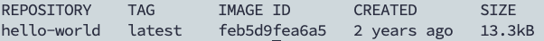

# Docker

## 1. 容器简介

### 1.1 什么是Linux容器

Linux容器是与系统其他部分隔离开的一系列进程，从另一个镜像运行，并由该镜像提供支持进程所需的全部文件。容器提供的镜像包含了应用的所有依赖项，因而在从开发到测试再到生产的整个过程中，它都具有可移植性和一致性

* 更加详细地来说，假定在开发一个应用。使用的是一台笔记本电脑，而本地开发环境具有特定的配置。其他开发人员身处的环境配置可能稍有不同。正在开发的应用依赖于当前本地的配置，还要依赖于某些特定文件。与此同时，企业还拥有标准化的测试和生产环境，且具有自身的配置和一系列支持文件。此时，希望尽可能多在本地模拟这些环境，而不产生重新创建[服务器](https://cloud.tencent.com/act/pro/promotion-cvm?from_column=20065&from=20065)环境的开销
* 因此，如何确保应用能够在这些环境中运行和通过质量检测，并且在部署过程中不出现令人头疼的问题，也无需重新编写代码和进行故障修复？答案就是使用容器。容器可以确保本都应用拥有必需的配置和文件，使得这些应用能够在从开发到测试、再到生产的整个流程中顺利运行，而不出现任何不良问题。这样可以避免危机，做到皆大欢喜

### 1.2 容器和虚拟化

* 虚拟化：虚拟化使得许多操作系统可同时在单个系统上运行
* 容器：共享同一个操作系统内核，将应用进程与系统其他部分隔离开

让多个操作系统在单个虚拟机监控程序上运行以实现虚拟化，并不能达成和使用容器同等的轻量级效果。事实上，在仅拥有容量有限的有限资源时，需要能够可以进行密集部署的轻量级应用。Linux 容器可从单个操作系统运行，在所有容器中共享该操作系统，因此应用和服务能够保持轻量级，并行快速运行。

## 2. 什么是Docker

### 2.1 Docker如何工作

Docker 技术使用 Linux 内核和内核功能（例如 Cgroups 和 namespaces）来分隔进程，以便各进程相互独立运行。这种独立性正是采用容器的目的所在；它可以独立运行多种进程、多个应用程序，更加充分地发挥基础设施的作用，同时保持各个独立系统的安全性。

容器工具（包括 Docker）可提供基于镜像的部署模式。这使得它能够轻松跨多种环境，与其依赖程序共享应用或服务组。Docker 还可在这一容器环境中自动部署应用程序（或者合并多种流程，以构建单个应用程序）。

此外，由于这些工具基于 Linux 容器构建，使得 Docker 既易于使用，又别具一格 —— 它可为用户提供前所未有的高度应用程访问权限、快速部署以及版本控制和分发能力

### 2.2 Docker技术是否与传统的Linux容器相同

否。Docker 技术最初是基于 LXC 技术构建（大多数人都会将这一技术与“传统的” Linux 容器联系在一起），但后来它逐渐摆脱了对这种技术的依赖。

就轻量级虚拟化这一功能来看，LXC 非常有用，但它无法提供出色的开发人员或用户体验。除了运行容器之外，Docker 技术还具备其他多项功能，包括简化用于构建容器、传输镜像以及控制镜像版本的流程。

传统的 Linux 容器使用 init 系统来管理多种进程。这意味着，所有应用程序都作为一个整体运行。与此相反，Docker 技术鼓励应用程序各自独立运行其进程，并提供相应工具以实现这一功能。这种精细化运作模式自有其优势。

### 2.3 Docker的组成


**images**：镜像

Docker镜像就是一个模版，可以通过这个模版来创建容器服务，镜像=>run=>容器

**container**：容器

Docker利用容器技术，独立运行一个或则一个组应用，容器通过镜像来创建

具有启动、停止、删除等基本命令

**repository**：仓库

仓库就是存放镜像的地方

仓库分为公有仓库和私有仓库

### 2.4 Docker的目标

"Build,Ship and Run any App,Angwhere"-------构建，运输，处处运行

* 构建：创建一个docker镜像
* 运输：docker pull
* 运行：启动容器

每一个容器都有自己的文件系统：rootfs

* 应用更快速的交付和部署

  传统：帮助文档，安装程序

  Docker：打包镜像发布测试，一键运行

* 更便捷的升级和扩缩容

  使用Docker之后，部署应用就和搭积木一样

  项目打包为一个镜像，扩展到多个服务器

* 更简单的系统运维

  在容器化之后，开发和测试环境高度一致

* 更高效的计算资源利用

  Docker是内核级别的虚拟化，可以在一个物理机上可运行很多容器实例，服务器的性能可以被压榨到极致

### 2.5 Docker底层原理

#### 2.5.1 Docker是怎么工作的

Docker是一个Client-Server结构的系统，Docker的守护进程在主机上，通过socket从客户端访问

DockerServer接收到Docker-Client的指令，就会执行该命令


#### 2.5.2 Docker为什么比VM快

1.Docker有着比虚拟机更少的抽象层

2.Docker利用的是主机的内核，VM需要Guest OS。VM需要重新加载一个操作系统内核，有复杂引导过程；新建容器时，Docker直接使用主机操作系统，省略了复杂的引导过程


## 3. 安装Docker和配置

### 3.1 安装Docker

* 更新软件包索引

  ```bash
  $ sudo apt update
  ```

* 安装必要依赖

  ```bash
  $ sudo apt install apt-transport-https ca-certificates curl gnupg-agent software-properties-common
  ```

* 使用curl导入源仓库GPG Key

  ```bash
  $ curl -fsSL https://download.docker.com/linux/ubuntu/gpg | sudo apt-key add -
  ```

* 将Docker APT软件源添加到系统

  ```bash
  $ sudo add-apt-repository "deb [arch=amd64] https://download.docker.com/linux/ubuntu $(lsb_release -cs) stable"
  ```

* 安装Docker最新版本

  ```bash
  $ sudo apt update
  # 安装docker相关，docker-ce:社区版
  $ sudo apt install docker-ce docker-ce-cli containerd.io
  ```

* 验证是否安装成功

  ```bash
  sudo systemctl status docker				# 查看docker服务运行状态
  ```

### 3.2 配置Docker

#### 3.2.1 配置用户组

* 运行docker命令时，docker出现没有权限的错误

  * 最直接办法是切换为root用户进行

  * 推荐方式为添加docker的用户组，将当前用户添加到组中

    ```bash
    sudo groupadd docker								# 添加用户组
    sudo gpasswd -a username docker			# 将当前用户添加到用户组
    newgrp docker												# 更新用户组
    ```

#### 3.2.2 配置镜像进行加速

```bash
$ vim /etc/docker/daemon.json

# 修改为下面形式
{
    "registry-mirrors": [
        "https://registry.hub.docker.com",
        "http://hub-mirror.c.163.com",
        "https://mirror.baidubce.com",
        "https://docker.mirrors.sjtug.sjtu.edu.cn",
        "https://docker.nju.edu.cn"
    ]
}
```

```bash
sudo systemctl daemon-reload					# 重新加载服务的配置文件
sudo systemctl restart docker					# 重新启动docker服务
```

## 4. Docker常用命令

### 4.1 镜像基本命令

* 查看Docker版本信息

  ```bash
  $ docker version
  ```

  

* 查看Docker详细信息

  ```bash
  $ docker info
  ```

  

* Docker查看指定命令的帮助文件

  ```bash
  docker 命令 --help
  ```

* 查看镜像信息

  ```bash
  $ docker images
  
  # 输出
  REPOSITORY    TAG       IMAGE ID       CREATED       SIZE
  hello-world   latest    feb5d9fea6a5   2 years ago   13.3kB
  
  # 解释
  REPOSITORY		镜像的仓库源
  TAG						镜像的标签
  IMAGE ID			镜像的id
  CREATED				镜像的创建时间
  SIZE					镜像的大小
  
  # docker images可选参数
  -a, --all    		# 列出所有镜像
  -f, --filter 		# 设置过滤条件
  -q, --quiet  		# 只显示镜像ID
  ```

* 搜索镜像

  ```bash
  $ docker search
  
  # 可选参数
  -f,--filter				# 设置搜索条件
  eg:docker search cuda -f STARS=3000/docker search --filter=STARS=300
  ```

* 下载镜像

  ```bash
  $ docker pull mysql					# 默认下载最新的
  $ docker pull mysql:5.7			# 下载指定版本的镜像
  ```


* 删除镜像

  ```bash
  $ docker rmi -f 镜像id/镜像名字							# 删除单个镜像
  $ docker rmi -f 镜像id 镜像id 镜像id ...		# 删除多个镜像
  $ docker rmi -f $(docker images -aq)			# 删除全部容器
  ```

### 4.2 容器命令

说明：有了镜像才可以创建容器

* 新建容器并启动

  ```bash
  $ docker run [可选参数] image
  
  # 参数说明
  --name="Name"			设置容器名字
  -d								后台方式运行
  -it								使用交互方式运行，进行容器查看内容
  -p								指定容器端口			eg:8080:8080
  			# 使用格式
  			-p ip:主机端口:容器端口
  			-p 主机端口:容器端口
  			-p 容器端口
  			容器端口
  -P								随机指定端口
  ```

* 从容器中退出到主机

  ```bash
  $ exit						# 容器停止并退出
  $ ctrl+p+q				# 容器不停止退出
  ```

* 列出容器

  ```bash
  $ docker ps				# 列出运行中的容器
  
  $ docker ps -a		# 列出所有容器，包含历史运行过的容器
  
  $ docker ps -a -n=1 # 列出最近使用的一个容器
  
  $ docker ps -q 			# 只显示容器的编号
  ```

* 删除容器

  ```bash
  $ docker rm 容器id							# 删除指定容器
  $ docker rm -f $(docker ps -aq)#删除所有的容器，正在运行的不能删除，强制删除通过-rf
  $ docker ps -a -q|xargs docker rm			# 删除所有容器
  ```

* 启动（已有的容器）和停止容器

  ```bash
  docker start 容器id					# 启动容器
  docker restart 容器id				# 重启容器
  docker stop 容器id					# 停止当前正在运行的容器
  docker kill 容器id					# 强制停止指定容器
  ```

* 后台启动容器

  


```bash
$  docker run hello-world					# 启动一个docker
```


```bash
$ docker images			# 查看镜像信息
```




* 创建并运行一个docker

  ```bash
  docker run -d -p 80:80 name
  # run：	创建并运行一个容器
  # -d：	放入后台
  # -p：	端口映射
  # name：	容器名称
  ```

* 查看正在运行的容器

  ```bash
  # 方式一
  docker container ls
  
  # 方式二
  docker ps
  
  # 查看所有容器
  docker ps -a
  ```

* 停止容器

  ```bash
  # 方式一
  docker stop 容器名称/id
  
  # 方式二
  docker container kill 容器名称/id
  ```

* 进入容器

  ```bash
  docker run -it
  ```


## 附录

* 不要以拆分方式进行应用程序发布

* 不要创建大型镜像

* 不要在单个容器中运行多个进程

* 不要再镜像内保存凭证，不要依赖IP地址

* 以非root用户运行进程

* 不要使用“最新”标签

* 不要利用运行中的容器创建镜像

* 不要使用单层镜像

* 不要将数据存放在容器内


