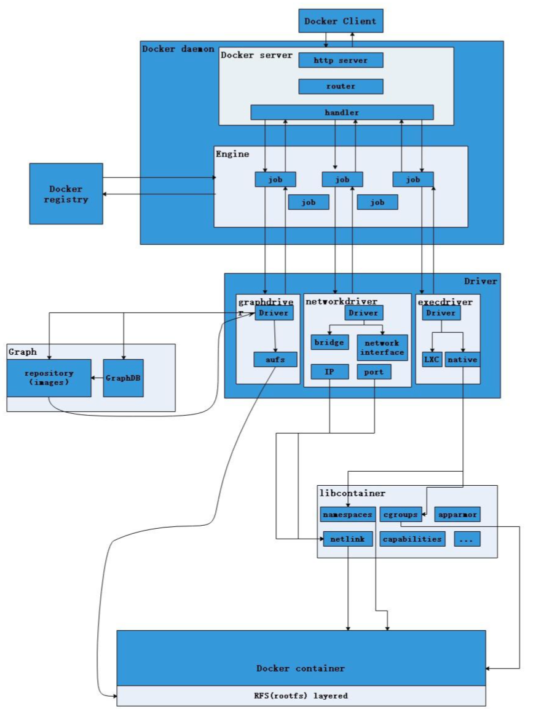
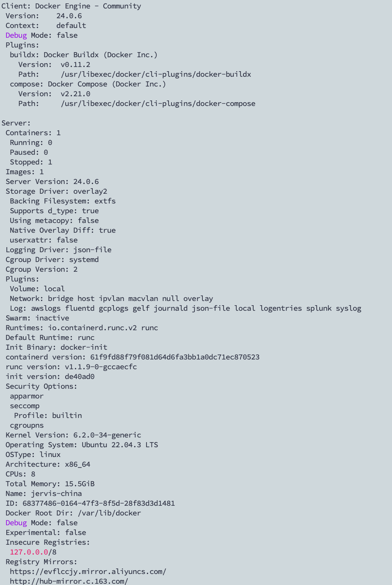
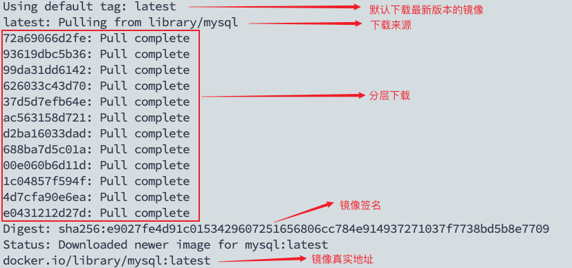
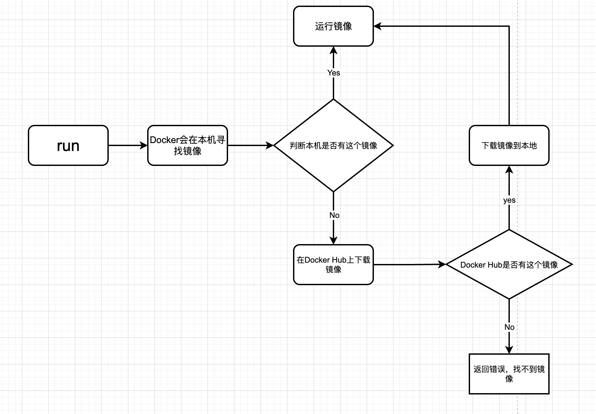

# Docker

## 1. 容器简介

### 1.1 什么是Linux容器

Linux容器是与系统其他部分隔离开的一系列进程，从另一个镜像运行，并由该镜像提供支持进程所需的全部文件。容器提供的镜像包含了应用的所有依赖项，因而在从开发到测试再到生产的整个过程中，它都具有可移植性和一致性

* 更加详细地来说，假定在开发一个应用。使用的是一台笔记本电脑，而本地开发环境具有特定的配置。其他开发人员身处的环境配置可能稍有不同。正在开发的应用依赖于当前本地的配置，还要依赖于某些特定文件。与此同时，企业还拥有标准化的测试和生产环境，且具有自身的配置和一系列支持文件。此时，希望尽可能多在本地模拟这些环境，而不产生重新创建[服务器](https://cloud.tencent.com/act/pro/promotion-cvm?from_column=20065&from=20065)环境的开销
* 因此，如何确保应用能够在这些环境中运行和通过质量检测，并且在部署过程中不出现令人头疼的问题，也无需重新编写代码和进行故障修复？答案就是使用容器。容器可以确保本都应用拥有必需的配置和文件，使得这些应用能够在从开发到测试、再到生产的整个流程中顺利运行，而不出现任何不良问题。这样可以避免危机，做到皆大欢喜

### 1.2 容器和虚拟化

* 虚拟化：虚拟化使得许多操作系统可同时在单个系统上运行
* 容器：共享同一个操作系统内核，将应用进程与系统其他部分隔离开

让多个操作系统在单个虚拟机监控程序上运行以实现虚拟化，并不能达成和使用容器同等的轻量级效果。事实上，在仅拥有容量有限的有限资源时，需要能够可以进行密集部署的轻量级应用。Linux 容器可从单个操作系统运行，在所有容器中共享该操作系统，因此应用和服务能够保持轻量级，并行快速运行。

## 2. 什么是Docker

### 2.1 Docker如何工作

Docker 技术使用 Linux 内核和内核功能（例如 Cgroups 和 namespaces）来分隔进程，以便各进程相互独立运行。这种独立性正是采用容器的目的所在；它可以独立运行多种进程、多个应用程序，更加充分地发挥基础设施的作用，同时保持各个独立系统的安全性。

容器工具（包括 Docker）可提供基于镜像的部署模式。这使得它能够轻松跨多种环境，与其依赖程序共享应用或服务组。Docker 还可在这一容器环境中自动部署应用程序（或者合并多种流程，以构建单个应用程序）。

此外，由于这些工具基于 Linux 容器构建，使得 Docker 既易于使用，又别具一格 —— 它可为用户提供前所未有的高度应用程访问权限、快速部署以及版本控制和分发能力

### 2.2 Docker技术是否与传统的Linux容器相同

否。Docker 技术最初是基于 LXC 技术构建（大多数人都会将这一技术与“传统的” Linux 容器联系在一起），但后来它逐渐摆脱了对这种技术的依赖。

就轻量级虚拟化这一功能来看，LXC 非常有用，但它无法提供出色的开发人员或用户体验。除了运行容器之外，Docker 技术还具备其他多项功能，包括简化用于构建容器、传输镜像以及控制镜像版本的流程。

传统的 Linux 容器使用 init 系统来管理多种进程。这意味着，所有应用程序都作为一个整体运行。与此相反，Docker 技术鼓励应用程序各自独立运行其进程，并提供相应工具以实现这一功能。这种精细化运作模式自有其优势。

### 2.3 Docker的组成


**images**：镜像

Docker镜像就是一个模版，可以通过这个模版来创建容器服务，镜像=>run=>容器

**container**：容器

Docker利用容器技术，独立运行一个或则一个组应用，容器通过镜像来创建

具有启动、停止、删除等基本命令

**repository**：仓库

仓库就是存放镜像的地方

仓库分为公有仓库和私有仓库

### 2.4 Docker的目标

"Build,Ship and Run any App,Angwhere"-------构建，运输，处处运行

* 构建：创建一个docker镜像
* 运输：docker pull
* 运行：启动容器

每一个容器都有自己的文件系统：rootfs

* 应用更快速的交付和部署

  传统：帮助文档，安装程序

  Docker：打包镜像发布测试，一键运行

* 更便捷的升级和扩缩容

  使用Docker之后，部署应用就和搭积木一样

  项目打包为一个镜像，扩展到多个服务器

* 更简单的系统运维

  在容器化之后，开发和测试环境高度一致

* 更高效的计算资源利用

  Docker是内核级别的虚拟化，可以在一个物理机上可运行很多容器实例，服务器的性能可以被压榨到极致

### 2.5 Docker底层原理

#### 2.5.1 Docker内部构建

* Docker镜像（image）

  Docker镜像是一个只读的模版。一个镜像可以包含完整的ubuntu操作系统环境，里面仅安装了apache（web服务器）或用户需要的其他应用程序。镜像可以用来创建Docker容器，另外，Docker提供一个很简单的机制来创建镜像或则更新现有的镜像，可以直接从docker hub或其他人下载镜像直接使用

* Docker容器（container）

  Docker利用容器来运行应用。容器是从镜像创建的运行实例（类似类对象和类的关系），容器可以被启动，开始，停止，删除。每个容器之间相互隔离、保证平台的安全性。容器可以看作是一个简易版的Linux环境（包括root用户权限，进程空间，用户空间和网络空间）和运行在其中的应用程序

* Docker仓库（repository）

  仓库是几种存放镜像文件的场所。区别于仓库注册服务器（Registry），仓库注册服务器上一般存在多个仓库，每个仓库中包含多个镜像，每个镜像有不同的标签（TAG）。仓库注册服务器可以理解为Github类似的托管服务

  仓库分为私有仓库和公有仓库，最大的仓库为docker hub。用户可以通过本地网络创建一个私有仓库。当用户创建了自己的镜像可以使用push命令上其上传到仓库，下一次其他机器使用时，直接使用pull命令从仓库下载即可

#### 2.5.2 Docker总体架构分解



* Docker Client

  Docker Client是Docker架构中用户用来和Docker Daemon建立通信的客户端。用户可以使用的可执行文件为docker，通过docker命令行工具可以发起管理container的请求

  Docker Client可以通过一下三种方式和Docker daemon建立通信:

  * tcp://hostport
  * unix://path_to_socket
  * fd://socktfd

  Docker Client于Docker Daemon建立连接并传输请求的时候，Docker Client可以通过设置命令行flag参数的形式设置安全传输层协议（TLS）参数，保证传输的安全性

  Docker Client发出容器管理请求后，由Docker Daemon接受并处理。当Docker Client接受到返回的请求响应，Docker Client一次完整的生命周期就结束了。当需要继续发送容器管理请求时，用户必须再次通过docker可执行文件创建Docker Client

* Docker Daemon

  Docker Daemon是Docker架构中常驻在后台的系统进程，功能是接受并处理Docker Client发送的请求。该守护进程在后台启动一个Server，Server负责接受Docker Client发送的请求，Server用过路由分发调度，找到相应的Handler来执行请求

  Docker Daemon启动所使用的可执行文件也为docker，与Docker Client启动所使用的可执行文件docker相同。docker在执行命令时，通过传入参数来判断Docker Daemon和Docker Client

  Docker Daemon的架构，大致分为Docker Server、Engine、Job

* Docker Server

  在Docker架构中专门服务于Docker Client。接受并调度分发Docker Client发送的请求。Docker启动过程中，通过包gorilla/mux，创建一个`mux.router`，提供请求的理由功能。该`mux.router`中添加了很多的路由项，每个路由项由HTTP请求方法、URL、Handler三部分组成。若`Docker Client`通过HTTP的形式访问Docker Daemon，创建完`mux.Router`之后，Docker将Server的监听地址以及`mux.Router`作为参数，创建一个`httpSrv=http.Server{}`，最终执行`httpSrv.Serve()`为请求服务。在Server的服务过程中，Server在listener上接受Docker Client的访问请求，并创建一个全新的goroutine来服务该请求。在goroutine中，首先读取请求内容，然后做解析工作，接着找到相应的路由项，随后调用相应的Handler来处理该请求，最后Handler处理完请求之后回复该请求。

  **需要注意的是：**Docker Server的运行在Docker的启动过程中，是靠一个名为`”serveapi”`的job的运行来完成的。原则上，**Docker Server的运行是众多job中的一个**，但是为了强调Docker Server的重要性以及为后续job服务的重要特性，将该”serveapi”的job单独抽离出来分析，理解为Docker Server

* Engine

  Engine是Docker架构中的运行引擎，同时也Docker运行的核心模块。它扮演Docker container存储仓库的角色，并且通过执行job的方式来操纵管理这些容器。

  在Engine数据结构的设计与实现过程中，有一个handler对象。该handler对象存储的都是关于众多特定job的handler处理访问。举例说明，Engine的handler对象中有一项为：`{“create”: daemon.ContainerCreate}`，则说明当名为”create”的job在运行时，执行的是`daemon.ContainerCreate的handler`。

* Job

  一个Job可以认为是Docker架构中**Engine内部最基本的工作执行单元**。Docker可以做的每一项工作，都可以抽象为一个job。例如：在容器内部运行一个进程，这是一个job；创建一个新的容器，这是一个job，从Internet上下载一个文档，这是一个job；包括之前在Docker Server部分说过的，创建Server服务于HTTP的API，这也是一个job，等等。

  Job的设计者，把Job设计得与Unix进程相仿。比如说：Job有一个名称，有参数，有环境变量，有标准的输入输出，有错误处理，有返回状态等。

* Docker Registry

  Docker Registry是一个存储容器镜像的仓库。而容器镜像是在容器被创建时，被加载用来初始化容器的文件架构与目录。

  在Docker的运行过程中，Docker Daemon会与Docker Registry通信，并实现搜索镜像、下载镜像、上传镜像三个功能，这三个功能对应的job名称分别为”search”，”pull” 与 “push”。

  其中，在Docker架构中，Docker可以使用公有的Docker Registry，即大家熟知的Docker Hub，如此一来，Docker获取容器镜像文件时，必须通过互联网访问Docker Hub；同时Docker也允许用户构建本地私有的Docker Registry，这样可以保证容器镜像的获取在内网完成。

* Graph

  Graph在Docker架构中扮演已下载容器镜像的保管者，以及已下载容器镜像之间关系的记录者。一方面，Graph存储着本地具有版本信息的文件系统镜像，另一方面也通过GraphDB记录着所有文件系统镜像彼此之间的关系

  其中，GraphDB是一个构建在SQLite之上的小型图数据库，实现了节点的命名以及节点之间关联关系的记录。它仅仅实现了大多数图数据库所拥有的一个小的子集，但是提供了简单的接口表示节点之间的关系。

  同时在Graph的本地目录中，关于每一个的容器镜像，具体存储的信息有：该容器镜像的元数据，容器镜像的大小信息，以及该容器镜像所代表的具体rootfs。

* Driver

  Driver是Docker架构中的**驱动模块**。通过Driver驱动，Docker可以实现对Docker容器执行环境的定制。由于Docker运行的生命周期中，并非用户所有的操作都是针对Docker容器的管理，另外还有关于Docker运行信息的获取，Graph的存储与记录等。因此，为了将Docker容器的管理从Docker Daemon内部业务逻辑中区分开来，设计了Driver层驱动来接管所有这部分请求。

  在Docker Driver的实现中，可以分为以下三类驱动：graphdriver、networkdriver和execdriver。

  * graphdriver主要用于完成容器镜像的管理，包括存储与获取。即当用户需要下载指定的容器镜像时，graphdriver将容器镜像存储在本地的指定目录；同时当用户需要使用指定的容器镜像来创建容器的rootfs时，graphdriver从本地镜像存储目录中获取指定的容器镜像。在graphdriver的初始化过程之前，有4种文件系统或类文件系统在其内部注册，它们分别是aufs、btrfs、vfs和devmapper。而Docker在初始化之时，通过获取系统环境变量”DOCKER_DRIVER”来提取所使用driver的指定类型。而之后所有的graph操作，都使用该driver来执行。
  * networkdriver的用途是完成Docker容器网络环境的配置，其中包括Docker启动时为Docker环境创建网桥；Docker容器创建时为其创建专属虚拟网卡设备；以及为Docker容器分配IP、端口并与宿主机做端口映射，设置容器防火墙策略等
  * execdriver作为Docker容器的执行驱动，负责创建容器运行命名空间，负责容器资源使用的统计与限制，负责容器内部进程的真正运行等。在execdriver的实现过程中，原先可以使用LXC驱动调用LXC的接口，来操纵容器的配置以及生命周期，而现在execdriver默认使用native驱动，不依赖于LXC。具体体现在Daemon启动过程中加载的ExecDriverflag参数，该参数在配置文件已经被设为”native”。这可以认为是Docker在1.2版本上一个很大的改变，或者说Docker实现跨平台的一个先兆

* libcontainer

  libcontainer是Docker架构中一个使用Go语言设计实现的库，设计初衷是希望该库可以不依靠任何依赖，直接访问内核中与容器相关的API。

  正是由于libcontainer的存在，Docker可以直接调用libcontainer，而最终操纵容器的namespace、cgroups、apparmor、网络设备以及防火墙规则等。这一系列操作的完成都不需要依赖LXC或者其他包

  另外，libcontainer提供了一整套标准的接口来满足上层对容器管理的需求。或者说，libcontainer屏蔽了Docker上层对容器的直接管理。又由于libcontainer使用Go这种跨平台的语言开发实现，且本身又可以被上层多种不同的编程语言访问，因此很难说，未来的Docker就一定会紧紧地和Linux捆绑在一起。而于此同时，Microsoft在其著名云计算平台Azure中，也添加了对Docker的支持，可见Docker的开放程度与业界的火热度。

  暂不谈Docker，由于libcontainer的功能以及其本身与系统的松耦合特性，很有可能会在其他以容器为原型的平台出现，同时也很有可能催生出云计算领域全新的项目

* Docker container

  Docker container（Docker容器）是Docker架构中服务交付的最终体现形式。

  Docker按照用户的需求与指令，订制相应的Docker容器：

  用户通过指定容器镜像，使得Docker容器可以自定义rootfs等文件系统； 用户通过指定计算资源的配额，使得Docker容器使用指定的计算资源； 用户通过配置网络及其安全策略，使得Docker容器拥有独立且安全的网络环境； 用户通过指定运行的命令，使得Docker容器执行指定的工作。

## 3. 安装Docker和配置

### 3.1 安装Docker

* 更新软件包索引

  ```bash
  $ sudo apt update
  ```

* 安装必要依赖

  ```bash
  $ sudo apt install apt-transport-https ca-certificates curl gnupg-agent software-properties-common
  ```

* 使用curl导入源仓库GPG Key

  ```bash
  $ curl -fsSL https://download.docker.com/linux/ubuntu/gpg | sudo apt-key add -
  ```

* 将Docker APT软件源添加到系统

  ```bash
  $ sudo add-apt-repository "deb [arch=amd64] https://download.docker.com/linux/ubuntu $(lsb_release -cs) stable"
  ```

* 安装Docker最新版本

  ```bash
  $ sudo apt update
  # 安装docker相关，docker-ce:社区版
  $ sudo apt install docker-ce docker-ce-cli containerd.io
  ```

* 验证是否安装成功

  ```bash
  sudo systemctl status docker  # 查看docker服务运行状态
  ```

### 3.2 配置Docker

#### 3.2.1 配置用户组

* 运行docker命令时，docker出现没有权限的错误

  * 最直接办法是切换为root用户进行

  * 推荐方式为添加docker的用户组，将当前用户添加到组中

    ```bash
    sudo groupadd docker  # 添加用户组
    sudo gpasswd -a username docker # 将当前用户添加到用户组
    newgrp docker # 更新用户组
    ```

#### 3.2.2 配置镜像进行加速

```bash
$ vim /etc/docker/daemon.json

# 修改为下面形式
{
    "registry-mirrors": [
        "https://registry.hub.docker.com",
        "http://hub-mirror.c.163.com",
        "https://mirror.baidubce.com",
        "https://docker.mirrors.sjtug.sjtu.edu.cn",
        "https://docker.nju.edu.cn"
    ]
}
```

```bash
sudo systemctl daemon-reload  # 重新加载服务的配置文件
sudo systemctl restart docker # 重新启动docker服务
```

## 4. Docker常用命令

### 4.1 镜像基本命令

* 查看Docker版本信息

  ```bash
  $ docker version
  ```

  

* 查看Docker详细信息

  ```bash
  $ docker info
  ```

  

* Docker查看指定命令的帮助文件

  ```bash
  docker 命令 --help
  ```

* 查看镜像信息

  ```bash
  $ docker images [options]
  
  # 输出
  REPOSITORY-TAGIMAGE ID-CREATED-SIZE
  
  
  # 解释
  REPOSITORY  #镜像的仓库源
  TAG         #镜像的标签
  IMAGE ID    #镜像的id
  CREATED     #镜像的创建时间
  SIZE        #镜像的大小
  
  # docker images可选参数
  -a, --all       # 列出所有镜像
  -f, --filter    # 设置过滤条件
      --format    # 使用自定义模版设置输出格式
  -q, --quiet     # 只显示镜像ID
  ```

* 搜索镜像

  ```bash
  $ docker search [options] TERM
  
  # 可选参数
  -f,--filter # 设置搜索条件
  eg:docker search cuda -f STARS=3000/docker search --filter=STARS=300
  ```

* 下载镜像

  ```bash
  $docker pull [options] NAME:VERSION
  
  # 可选参数（一般不使用）
  options：
  	-a 下载存储库中所有标记的映像
  	-q 抑制详细信息输出
  
  # eg:
  $ docker pull nvidia/cuda # 默认下载最新的
  $ docker pull nvidia/cuda:版本号  # 下载指定版本的镜像
  ```



* 删除镜像

  ```bash
  $ docker rmi [options] IMAGE
  
  $ docker rmi -f 镜像id/镜像名字 # 删除单个镜像
  $ docker rmi -f 镜像id 镜像id 镜像id ...  # 删除多个镜像
  $ docker rmi -f $(docker images -aq)  # 删除全部容器
  ```

### 4.2 容器命令

说明：有了镜像才可以创建容器

* 新建容器并启动

  ```bash
  $ docker run [options] IMAGE [COMMAND] [ARG...]
  
  # 参数说明
  --name="Name" #设置容器名字
  --network=host  #设置网络和主机相同
  --shm-size xx #设置共享内存
  --gpus all  #容器可使用的gpu
  --
  -d  #后台方式运行，docker使用后台运行，必须有一个前台进程，docker发现没有应用，会自动停止
  -it #使用交互方式运行，进行容器查看内容
  -p  #指定容器端口 eg:8080:8080
  		# 使用格式
  			#-p ip:主机端口:容器端口
  			#-p 主机端口:容器端口
  			#-p 容器端口
  			#容器端口
  -P  ##随机指定端口
  ```

  docker run流程:

* 从容器中退出到主机

  ```bash
  $ exit  # 容器停止并退出
  $ ctrl+p+q  # 容器不停止退出
  ```

* 列出容器

  ```bash
  $ docker ps [options] # 列出运行中的容器
  
  options:
  	-a 列出所有的容器
  	-f 条件：设置显示条件
  	-n num：显示最近的创建的num个容器
  	-l 显示最近创建的容器
  	-q 只显示容器id
  	-s 显示总大小
  ```

* 删除容器

  ```bash
  $ docker rm [options] CONTAINER
  
  	-f  # 删除过滤条件
  	-l  # 删除指定的链接
  	-v  # 删除与容器关联的匿名卷
  
  $ docker rm 容器id  # 删除指定容器
  $ docker rm -f $(docker ps -aq) # 删除所有的容器，正在运行的不能删除，强制删除通过-rf
  $ docker ps -a -q|xargs docker rm	# 删除所有容器
  ```

* 启动（已有的容器）和停止容器

  ```bash
  docker start 容器id # 启动容器
  docker restart 容器id # 重启容器
  docker stop 容器id  # 停止当前正在运行的容器
  docker kill 容器id  # 强制停止指定容器
  ```

### 4.3 其他命令

* 查看日志

  ```bash
  $ docker logs [options] CONTAINER_ID
  
  options:
    -f  # 格式化输出
    -n num  # 输出最后n条logs
    -t  # 添加时间戳
  ```

* 查看同容器中的进程信息

  ```bash
  $ docker top CONTAINER_ID
  ```

* 查看镜像元数据

  ```bash
  $ docker inspect [options] CONTAINER_ID
  ```

* 进入当前正在运行的容器

  ```bash
  # 方式一，进入容器中开启新的终端
  $ docker exec [options] CONTAINER COMMAND [ARG...]
  
  options:
  	-d # 后台方式运行
  	-e # 设置环境变量，可以对资源进行限制（内存）
  	-t # 分配一个伪tty，交互终端
  	-u # 用户名称
  	-w # 容器内的工作目录
  	-i # 如果没有连接也保持一个标准输入
  	
  # 方式二，进入容器正在执行的终端，不会启动新的进程
  $ docker attach [options] CONTAINER 
  ```

* 从容器内拷贝文件到主机上

  ```bash
  $ docker cp CONTAINER_ID:CONTAINER_PATH HOST_PATH
  ```

* 查看资源占用信息

  ```bash
  $ docker stats
  ```

* 提交自己的容器转换为镜像保存到本地

  ```bash
  $ docker commit [options] CONTAINER：TAG
  
  options:
  	-a # 用户名称
  	-c # 将Dockerfile指令应用于创建映像
  	-m # 提交信息
  	-p # 提交期间暂停容器，默认为true
  ```

## 5. Docker数据卷

### 5.1 数据挂载

将Docker产生的数据，同步到本地。将容器中的目录挂在到宿主机，容器删除时，不影响宿主机数据

```bash
$ docker run -it -v 主机目录:容器内目录:权限（ro只读，rw读写）				# 会自动创建文件
```

挂载方式：具名挂载和匿名挂载

```bash
# 匿名挂载
-v 容器内路径
$ docker run -d -P --name cuda -v /ect/nginx nginx

# 查看所有的volume的情况
$ docker volume ls

# 具名挂载，-v 卷名:容器内路径
# 查看卷信息
$ docker volume inspect 卷名

# 所有的docker容器内的卷，没有指定目录的情况下都是在/var/lib/docker/volumes/xxx/_data
```

### 5.2 容器间数据共享

```bash
$ docker run -it --name 容器名称 --volumes-from 存在容器名称 IMAGE

# 容器间数据共享只要有一个容器存在，则数据依旧存在
```

## 6. Docker file

### 6.1 Dockerfile简介

由于构建Docker镜像，本质上是命令参数脚本

构建步骤

* 编写一个dockerfile文件

* docker build构建称为一个镜像

* docker run创建一个容器

* docker push发布镜像（docker hub、阿里云镜像仓库）


### 6.2  Dockerfile构建过程

#### 6.2.1 基础知识

* 每个保留关键字都必须是大写字母
* 从上到下进行执行
* #号进行注释
* 每一行指令都会创建提交一个新的镜像层，并提交

#### 6.2.2 Dockerfile命令

```dockerfile
FROM          # 基础镜像，一切从这里开始构建
MAINTAINER    #	维护者信息，姓名+邮箱(已舍弃) 现在为LABEL
RUN           # 镜像构建的时需要运行的命令
ADD           # COPY文件，会自动解压
WORKDIR       # 设置当前工作目录
VOLUME        # 设置卷，挂在到主机目录
EXPOSE        # 指定对外端口
CMD           # 指定这个容器启动时运行的命令，只有最后一个生效
ENTRYPOINT    # 指定这个容器启动时运行的命令，可以追加命令
ONBUILD       # 当构建一个被继承 Dockerfile，这个时候就会运行ONBUILD的指令
COPY          # 将文件拷贝到镜像中，不会自动解压
ENV           # 构建的是否设置环境变量
```

```bash
$ docker build -f DOCKERFILE_PATH -t 镜像名:[tag] # 从Dockerfile创建镜像
```

```bash
$ docker history IMAGE  # 查看镜像是怎么一步一步构建的
```

## 7. 发布镜像

* 需要自己Docker HUB账号，进行登陆

```bash
$ docker login [options] [SERVER]

options:
	-p  密码
	-u	用户名
```

* 上传到Docker HUB

```bash
$ docker push IMAGE:TAG
```

* 给镜像添加标签

```bash
$ docker tag IMAGE_ID IMAGE:TAG
```

* 发布到阿里云镜像

  * 创建命名空间

  * 创建容器镜像
  * 阿里云有详细的介绍

* 保存为压缩包和加载

  ```bash
  $ docker save -o PATH # 保存镜像为压缩包
  
  $ docker load -i PATH # 加载压缩包为镜像
  ```


## 8. Docker实战

### 8.1 分析YOLOv8Dockerfile

```dockerfile
# Image is CUDA-optimized for YOLOv8 single/multi-GPU training and inference
# 通过Dockerfile构建的镜像，用与YOLOv8进行单/多GPU训练和推理

# Start FROM PyTorch image https://hub.docker.com/r/pytorch/pytorch or nvcr.io/nvidia/pytorch:23.03-py3
# 基础镜像来自pytorch/pytorch:2.1.0-cuda12.1-cudnn8-runtime
FROM pytorch/pytorch:2.1.0-cuda12.1-cudnn8-runtime

# 构建镜像的时候通过pip安装nvidia-tensorrt包
RUN pip install --no-cache nvidia-tensorrt --index-url https://pypi.ngc.nvidia.com

# Downloads to user config dir
# 下载配置文件和资源文件
ADD https://ultralytics.com/assets/Arial.ttf https://ultralytics.com/assets/Arial.Unicode.ttf /root/.config/Ultralytics/

# Install linux packages
# g++ required to build 'tflite_support' and 'lap' packages, libusb-1.0-0 required for 'tflite_support' package
# 构建镜像的安装依赖
RUN apt update \
    && apt install --no-install-recommends -y gcc git zip curl htop libgl1-mesa-glx libglib2.0-0 libpython3-dev gnupg g++ libusb-1.0-0
# RUN alias python=python3

# Security updates
# 进行安全更新
# https://security.snyk.io/vuln/SNYK-UBUNTU1804-OPENSSL-3314796
RUN apt upgrade --no-install-recommends -y openssl tar

# Create working directory
# 创建一个工作目录
WORKDIR /usr/src/ultralytics

# 构建镜像时，从git下载main分支到容器路径/usr/src/ultralytics
RUN git clone https://github.com/ultralytics/ultralytics -b main /usr/src/ultralytics
# 从指定路径下载yolov8n.pt权重到容器路径/usr/src/ultralytics/
ADD https://github.com/ultralytics/assets/releases/download/v0.0.0/yolov8n.pt /usr/src/ultralytics/

# Install pip packages
# 安装pip包
RUN python3 -m pip install --upgrade pip wheel
# 安装必须的包
RUN pip install --no-cache -e ".[export]" albumentations comet pycocotools pytest-cov

# Run exports to AutoInstall packages
RUN yolo export model=tmp/yolov8n.pt format=edgetpu imgsz=32
RUN yolo export model=tmp/yolov8n.pt format=ncnn imgsz=32
# Requires <= Python 3.10, bug with paddlepaddle==2.5.0 https://github.com/PaddlePaddle/X2Paddle/issues/991
RUN pip install --no-cache paddlepaddle==2.4.2 x2paddle
# Fix error: `np.bool` was a deprecated alias for the builtin `bool` segmentation error in Tests
RUN pip install --no-cache numpy==1.23.5
# Remove exported models
# 删除已经tmp文件夹
RUN rm -rf tmp

# Set environment variables
# 设置环境变量
ENV OMP_NUM_THREADS=1
# Avoid DDP error "MKL_THREADING_LAYER=INTEL is incompatible with libgomp.so.1 library" https://github.com/pytorch/pytorch/issues/37377
ENV MKL_THREADING_LAYER=GNU
```


## 附录

* 不要以拆分方式进行应用程序发布

* 不要创建大型镜像

* 不要在单个容器中运行多个进程

* 不要再镜像内保存凭证，不要依赖IP地址

* 以非root用户运行进程

* 不要使用“最新”标签

* 不要利用运行中的容器创建镜像

* 不要使用单层镜像

* 不要将数据存放在容器内


